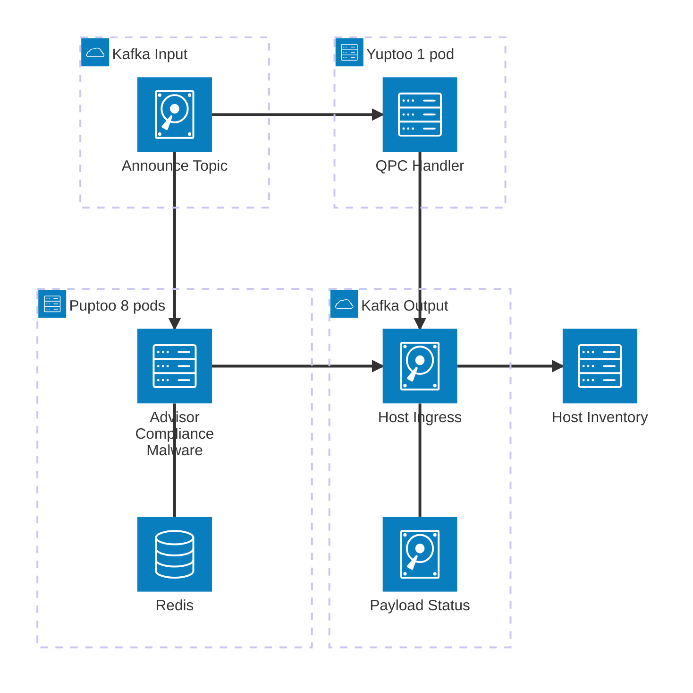
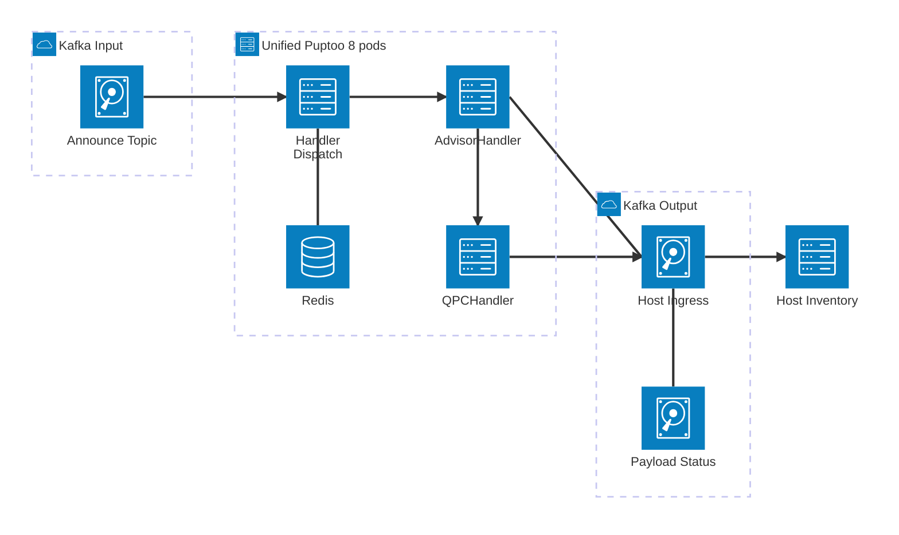

# Google Slides Draft: Unified Upload Processor

**Live deck:** [Google Slides](https://docs.google.com/presentation/d/1TOqGv-49O1DcKl1hcW0Z_NXtttQ0uk26m0LmIFy0nfU/edit?usp=sharing)

Use this document as the source of truth for slide content. Each section is one slide.

**To render Mermaid diagrams as PNG:** Go to [mermaid.live](https://mermaid.live), paste the Mermaid code, download as PNG, insert into slide.

---

## Slide 1: Title

**Title:** Unified Upload Processor: Architecture Proposal

**Subtitle:** Merging yuptoo into insights-puptoo

**Bottom:** Pranav Lawate | Insights-Framework | June 2026

> **Speaker notes:** Welcome everyone. I have been working on a proposal to merge our two upload processor services into one. This meeting is to share the approach, get your feedback, and align on timeline and resources.

---

## Slide 2: Two Services, One Job

**Title:** The Current State: Two Services, One Job

| | insights-puptoo | yuptoo |
|---|---|---|
| **Purpose** | Advisor, compliance, malware-detection | QPC (Quipucords) |
| **Replicas** | 8 | 1 |
| **Input** | platform.upload.announce | platform.upload.announce |
| **Output** | host-ingress, payload-status, validation | host-ingress, payload-status, validation |
| **Maintainer** | Insights-Framework | Insights-Framework |

**Key message:** Same input topic. Same output topics. Same downstream consumer (HBI). Same team.

> **Speaker notes:** Both services do the same fundamental job: consume from the announce topic, route by service header, transform the payload, and produce to host-ingress for HBI. The only differences are which service header they match and how they transform the data.

---

## Slide 3: The Cost of Running Two

**Title:** The Cost of Running Two

- **Infrastructure:** 2 ClowdApp manifests, 2 CI/CD pipelines, 2 Konflux configs, 2 consumer groups
- **Monitoring:** 2 dashboards, 2 alert sets, 2 pager entries
- **On-call:** Context-switching between two codebases for the same function
- **Dependencies:** 2 lockfiles with diverging versions of confluent-kafka, insights-core
- **Knowledge silos:** Improvements in one codebase are not shared with the other

**Call-out:** "Yuptoo has superior Kafka auth config that puptoo duplicates inline. Puptoo has safer commit semantics that yuptoo lacks. Neither benefits from the other."

> **Speaker notes:** The operational overhead is real. We maintain two of everything. And improvements do not cross-pollinate. Yuptoo solved the Kafka auth duplication problem; puptoo still has it. Puptoo commits after processing; yuptoo commits before, which can lose messages on crash.

---

## Slide 4: Current Architecture Diagram

**Title:** Architecture: As-Is

**Content:** Insert PNG rendered from this Mermaid (paste into [mermaid.live](https://mermaid.live), download as PNG):

> **Speaker notes:** Here is the current architecture. Two separate services, each with their own consumer group, consuming from the same Kafka topic and producing to the same output topics. The duplication is visible.

---

## Slide 5: Proposed Architecture

**Title:** The Proposal: One Service, All Upload Types

**Content:** Insert PNG rendered from this Mermaid (paste into [mermaid.live](https://mermaid.live), download as PNG):

> **Speaker notes:** The unified architecture. One consumer group, one deployment, one dashboard. The handler dispatch routes each message to the correct handler. Adding a new upload type means adding one handler class. No structural changes.

---

## Slide 6: Not Just a Merge

**Title:** Not Just a Merge: 12 Bug Fixes + Architecture Upgrades

**Architecture upgrades:**
- Handler dispatch pattern (replaces 314-line monolithic function)
- DRY Kafka auth config (adopted from yuptoo)
- Typed exception hierarchy (replaces bare `Exception`)

**Bug fixes (12 total):**
- At-least-once commit semantics (fixes yuptoo's commit-before-processing)
- Modifier pre-registration (fixes O(hosts x modifiers) import overhead)
- 6 puptoo fixes (swapped args, dead code, bare excepts, boolean parsing, dead metric)
- 6 yuptoo fixes (missing timeouts, ABC mismatch, no modifier ordering, validation spam)

**Dependency cleanup:**
- `uv` migration (upstream yuptoo branch in progress; puptoo on Poetry)

> **Speaker notes:** This is not a naive code port. I am adopting the best pattern from each codebase. DRY Kafka auth from yuptoo. At-least-once commit from puptoo. Handler dispatch and typed exceptions are new. I identified 12 bugs across both codebases that get fixed as part of this work. The uv migration for yuptoo is already in progress upstream.

---

## Slide 7: What Does NOT Change

**Title:** Scope: What Stays Untouched

- The `process/` directory (insights-core extraction, 37 profile test files): **untouched**
- The `system_profile` rule (~1,100 lines): **untouched**
- Advisor/compliance/malware processing logic: **extracted into handlers with identical logic**
- Redis retry mechanism: **unchanged**
- S3 yum_updates upload: **unchanged**

**Key message:** "We are only changing the routing and infrastructure layer. The extraction pipeline is completely out of scope."

> **Speaker notes:** I want to be explicit about what does not change. The entire insights-core extraction pipeline, the system_profile rule, all 37 profile test files: completely untouched. The processing logic is extracted into handler classes, but the logic itself is identical.

---

## Slide 8: Benefits

**Title:** Why This Change

| Benefit | Impact |
|---|---|
| **Reduced ops overhead** | 1 deployment, 1 dashboard, 1 pager entry instead of 2 |
| **Improved reliability** | 12 bug fixes; at-least-once semantics for all types |
| **Better architecture** | New upload type = 1 new handler class |
| **Unified dependencies** | 1 lockfile, 1 uv project, 1 CI matrix |
| **Knowledge consolidation** | 1 repo, lower bus factor |
| **Resource efficiency** | Eliminates yuptoo's dedicated pod |

> **Speaker notes:** Three categories of benefit. Operational: fewer things to maintain and page on. Reliability: fixing known bugs and adopting the safer commit pattern. Architecture: the handler dispatch is extensible; a new upload type is one class, not a new service.

---

## Slide 9: Risk Assessment

**Title:** Risks and Mitigations

| Risk | Prob. | Mitigation |
|---|---|---|
| Regression in advisor/compliance/malware | Low | 67 existing tests; verified in ephemeral before stage |
| QPC processing fails in merged service | Medium | Yuptoo stays deployed during cutover; 63 tests ported |
| Consumer group transition drops messages | Low | Both groups run simultaneously during cutover |

**Key message:** "Rollback is clean: revert puptoo, re-deploy yuptoo. Both consumer groups can run simultaneously."

> **Speaker notes:** The highest risk is QPC processing failing, rated medium. Mitigation: yuptoo stays deployed during the entire cutover. Both consumer groups run simultaneously, so no messages are lost. Rollback is clean and takes minutes.

---

## Slide 10: Sprint Plan

**Title:** Effort Estimate

| Sprint | Focus | Points |
|---|---|---|
| 1 | Refactor puptoo (handler dispatch, auth, exceptions, bug fixes) | 27 |
| 2-3 | Port QPC (modifiers, validators, handler, tests) | 30 |
| 4 | Stage/prod deployment, cutover, decommission | 13 |
| **Total** | | **70** |

> **Speaker notes:** 70 story points across 4 sprints. Sprint 1 is puptoo refactoring. Sprints 2-3 are QPC porting. Sprint 4 is deployment and cutover.

---

## Slide 11: Cutover Milestones

**Title:** Cutover Timeline

1. **Stage deployment** — deployment succeeds
2. **Stage validation** (+1-2 days) — IQE suites pass, no metric regression
3. **Prod deployment** (after stage sign-off) — deployment succeeds
4. **Prod monitoring** (+1-2 days) — error rates stable
5. **Grace period** (1-2 weeks) — yuptoo scaled to 0, zero consumer lag
6. **Decommission** — team sign-off, archive repo

**Key message:** Milestone-driven, not date-driven. We do not advance until gate criteria are met.

> **Speaker notes:** The cutover is milestone-driven. Each step has a gate that must pass before we move forward. Rollback is clean at any stage: revert puptoo, re-deploy yuptoo. Both consumer groups can run simultaneously during the transition.

---

## Slide 12: Discussion

**Title:** Discussion and Next Steps

**Open questions:**
1. Does the handler dispatch approach make sense?
2. Are there QPC edge cases I should know about?
3. Does the sprint plan align with team priorities?
4. Who should own the QPC/yuptoo expert role?

**Repo:** [github.com/pranlawate/puptoo-yuptoo-merge](https://github.com/pranlawate/puptoo-yuptoo-merge) (proposal, comparison, 24 JIRA-sized tasks)

**Next step if approved:** Create JIRA epic, begin Sprint 1.

> **Speaker notes:** I would like to open it up for discussion. The full proposal, comparison, and tasks are in the GitHub repo. If we align today, the next step is creating the JIRA epic.
