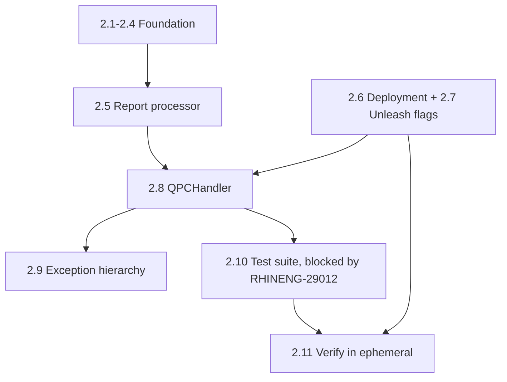

# Puptoo-Yuptoo Merge: Implementation Tasks

> **Living document, last synced with JIRA: 2026-08-05.** This is the current implementation status for Strategy A+ (merge yuptoo into puptoo, in-place, with a multi-deployment architecture). Unlike the other docs in this repo, this one is kept up to date as the project progresses. If you're reading this and it's been more than a couple of weeks since the sync date above, treat JIRA epic [RHINENG-27899](https://redhat.atlassian.net/browse/RHINENG-27899) as the higher-authority source for individual task status.

---

## Epic: [RHINENG-27899](https://redhat.atlassian.net/browse/RHINENG-27899) — Merge Yuptoo into Puptoo

**Repo strategy:** originally planned to stand up a new repo (`insights-upload-processor`). **Reversed 2026-07-20**: the team merges yuptoo's code directly into the existing [insights-puptoo](https://github.com/RedHatInsights/insights-puptoo) repo, gated by environment variables and Unleash feature flags. `insights-upload-processor` exists on GitHub but stays dormant until a final rename decision (see Phase 3, task 3.8).

**Service name:** decided as "Upload Processor" ([RHINENG-27900](https://redhat.atlassian.net/browse/RHINENG-27900), done). The repo/container image itself keeps the `insights-puptoo` name until the Phase 3 rename.

---

## Phase 1 ([27903](https://redhat.atlassian.net/browse/RHINENG-27903)): Refactor Puptoo + A+ Infrastructure — ✅ Complete (all PRs merged Jul 7, prod released Jul 20)

### Task 1.1: Create BaseHandler ABC and handler registry

**Type:** Story | **Points:** 3 | **JIRA:** [27904](https://redhat.atlassian.net/browse/RHINENG-27904) | **Status:** Done — [#766](https://github.com/RedHatInsights/insights-puptoo/pull/766)

Create a `handlers/` package in `src/puptoo/` with a `BaseHandler` abstract base class and a registry that maps service header values to handler instances.

---

### Task 1.2: Extract AdvisorHandler from app.py

**Type:** Story | **Points:** 5 | **JIRA:** [27905](https://redhat.atlassian.net/browse/RHINENG-27905) | **Status:** Done — [#766](https://github.com/RedHatInsights/insights-puptoo/pull/766)

Move the advisor-specific logic from `handle_message()` in `app.py` into `handlers/advisor.py`.

---

### Task 1.3: Extract ComplianceHandler from app.py

**Type:** Story | **Points:** 2 | **JIRA:** [27906](https://redhat.atlassian.net/browse/RHINENG-27906) | **Status:** Done — [#766](https://github.com/RedHatInsights/insights-puptoo/pull/766)

Move the compliance/malware-detection logic into `handlers/compliance.py`.

---

### Task 1.4: Refactor app.py main loop to use handler dispatch

**Type:** Story | **Points:** 3 | **JIRA:** [27907](https://redhat.atlassian.net/browse/RHINENG-27907) | **Status:** Done — [#766](https://github.com/RedHatInsights/insights-puptoo/pull/766)

Replace the `if service in [...]` chain with `get_handler(service)` dispatch.

---

### Task 1.5: Create mq/auth.py with kafka_auth_config()

**Type:** Task | **Points:** 2 | **JIRA:** [27908](https://redhat.atlassian.net/browse/RHINENG-27908) | **Status:** Done — [#775](https://github.com/RedHatInsights/insights-puptoo/pull/775)

Shared `kafka_auth_config()` (adopted from yuptoo's pattern) used by both consumer and producer.

---

### Task 1.6: Move send_message() and delivery_report() to mq/produce.py

**Type:** Story | **Points:** 3 | **JIRA:** [27909](https://redhat.atlassian.net/browse/RHINENG-27909) | **Status:** Done — [#789](https://github.com/RedHatInsights/insights-puptoo/pull/789)

Relocated from `app.py`, fixed swapped format args in `delivery_report()`.

---

### Task 1.7: Create typed exception hierarchy

**Type:** Story | **Points:** 2 | **JIRA:** [27910](https://redhat.atlassian.net/browse/RHINENG-27910) | **Status:** Done — [#795](https://github.com/RedHatInsights/insights-puptoo/pull/795)

`src/puptoo/exceptions.py` with `PuptooError`, `FailDownloadException`, `FailExtractException`, `QPCKafkaMsgException`, `QPCReportException`, `RetryExhaustedException`.

---

### Task 1.8: Add max.poll.interval.ms and SIGINT config

**Type:** Task | **Points:** 1 | **JIRA:** [27911](https://redhat.atlassian.net/browse/RHINENG-27911) | **Status:** Done — [#796](https://github.com/RedHatInsights/insights-puptoo/pull/796)

---

### Task 1.9: Fix puptoo bugs

**Type:** Task | **Points:** 2 | **JIRA:** [27912](https://redhat.atlassian.net/browse/RHINENG-27912) | **Status:** Done — [#797](https://github.com/RedHatInsights/insights-puptoo/pull/797)

Dead `clean_macs()` path, bare `except:` clauses, MinIO client pooling.

---

### Task 1.10: Write handler dispatch tests

**Type:** Story | **Points:** 2 | **JIRA:** [27913](https://redhat.atlassian.net/browse/RHINENG-27913) | **Status:** Done — [#766](https://github.com/RedHatInsights/insights-puptoo/pull/766)

---

### Task 1.11: Verify in ephemeral environment

**Type:** Task | **Points:** 2 | **JIRA:** [27914](https://redhat.atlassian.net/browse/RHINENG-27914) | **Status:** Done — [#791](https://github.com/RedHatInsights/insights-puptoo/pull/791)

**Phase 1 Total: 27 story points ✅** — Other Sprint 2 work landed alongside: `uv` migration ([27925](https://redhat.atlassian.net/browse/RHINENG-27925), done), pre-commit + ruff ([28038](https://redhat.atlassian.net/browse/RHINENG-28038), done), docker-compose modernization ([28248](https://redhat.atlassian.net/browse/RHINENG-28248), release pending), OpenTelemetry tracing ([28307](https://redhat.atlassian.net/browse/RHINENG-28307), done, merged Jul 10).

---

## Phase 1.5 ([28549](https://redhat.atlassian.net/browse/RHINENG-28549)): Infrastructure Investigation — Closed ✅ Jul 23

> [!important] What actually happened here
> This phase was originally scoped to stand up the new `insights-upload-processor` repo: namespace, Quay, Konflux, app-interface onboarding, CI/CD pipelines. On **2026-07-20** the team reversed that decision and chose to merge in-place into the existing `insights-puptoo` repo instead. Most of this phase's subtasks were closed as **Won't Do** as a direct result. The two subtasks that mattered regardless of repo strategy (naming decisions, PR queue cleanup, prod release) were completed.

| Task | JIRA | Summary | SP | Status |
|---|---|---|---|---|
| 1.5.0 | [28665](https://redhat.atlassian.net/browse/RHINENG-28665) | Phase 1 stage verification and production release | 3 | Done ✅ Jul 20 |
| 1.5.1 | [28550](https://redhat.atlassian.net/browse/RHINENG-28550) | Namespace and consumer group naming decisions | 1 | Done ✅ Jul 13. Decided `upload-processor-stage`/`-prod` namespace and `puptoo-upload-processor`/`yuptoo-upload-processor` groups — **the group names stuck even though the dedicated namespace itself did not** (superseded by the Jul 29 sync's "stay in existing namespace" call) |
| 1.5.2 | [28551](https://redhat.atlassian.net/browse/RHINENG-28551) | App-interface onboarding for new repo | 3 | **Won't Do** — repo strategy reversed |
| 1.5.3 | [28552](https://redhat.atlassian.net/browse/RHINENG-28552) | Quay repo + Konflux hermetic build for new repo | 5 | **Won't Do** — repo strategy reversed |
| 1.5.4 | [27902](https://redhat.atlassian.net/browse/RHINENG-27902) | Pipeline and pr_checks for new repo | 3 | **Won't Do** — repo strategy reversed |
| 1.5.5 | [28553](https://redhat.atlassian.net/browse/RHINENG-28553) | Push puptoo codebase into new repo | 1 | **Won't Do** — repo strategy reversed, using existing puptoo repo instead |
| 1.5.6 | [27901](https://redhat.atlassian.net/browse/RHINENG-27901) | Prepare test coverage plan | 2 | Closed by Gael (Jul 22) — replaced by Gael's new IQE + testing Story |
| 1.5.7 | [28554](https://redhat.atlassian.net/browse/RHINENG-28554) | Automated stage testing | 5 | Closed by Gael (Jul 22) — replaced by Gael's new IQE + testing Story |
| 1.5.8 | [28555](https://redhat.atlassian.net/browse/RHINENG-28555) | Clean puptoo PR queue (Dependabot + Konflux) | 5 | Done ✅ Jul 17 |

**Phase 1.5 Total: 28 story points, closed 2026-07-23.**

---

## Phase 2 ([27915](https://redhat.atlassian.net/browse/RHINENG-27915)): Port QPC Processing — In Progress, Pranav owns

11 independent Tasks under the epic (not subtasks — restructured Jul 30 after Phase 1.5 hit the same subtask-to-task conversion friction). Live view: [Phase-2_puptoo label filter](https://redhat.atlassian.net/issues/?jql=labels%20%3D%20%22Phase-2_puptoo%22). All 11 are in Sprint 4 (Aug 11/12 - Sep 2), assigned to Pranav.

| Task | JIRA | Summary | SP | Status |
|---|---|---|---|---|
| 2.1 | [27916](https://redhat.atlassian.net/browse/RHINENG-27916) | Modifier framework + 11 QPC modifier classes (pre-registered at startup, not per-host) | 5 | To Do |
| 2.2 | [27917](https://redhat.atlassian.net/browse/RHINENG-27917) | Port QPC report validators | 3 | To Do |
| 2.3 | [27919](https://redhat.atlassian.net/browse/RHINENG-27919) | Add QPC config variables (`APP_NAME`, `GROUP_ID`, `ENABLED_HANDLERS`, `INVENTORY_TOPIC`) | 2 | To Do |
| 2.4 | [27920](https://redhat.atlassian.net/browse/RHINENG-27920) | Add QPC metrics (`puptoo_qpc_*` prefix) | 2 | To Do |
| 2.5 | [27918](https://redhat.atlassian.net/browse/RHINENG-27918) | Port QPC report processor, with fixes (commit-after-processing, per-report validation messages, `timeout=120`, `INVENTORY_TOPIC` routing) | 5 | Blocked on 2.1, 2.2, 2.3 |
| 2.6 | [29361](https://redhat.atlassian.net/browse/RHINENG-29361) | Create QPC Kubernetes Deployment (8 pods, second `deployments:` entry on the existing ClowdApp) | 3 | To Do |
| 2.7 | [29362](https://redhat.atlassian.net/browse/RHINENG-29362) | Add 3 QPC Unleash feature flags (`puptoo.qpc-processing-enabled`, `puptoo.qpc-org-migration`, `puptoo.qpc-hosts-transformation`) | 2 | Blocked on [28933](https://redhat.atlassian.net/browse/RHINENG-28933) (Unleash foundation, in Code Review) |
| 2.8 | [27921](https://redhat.atlassian.net/browse/RHINENG-27921) | Create QPCHandler | 3 | Blocked on 2.3-2.7 |
| 2.9 | [27922](https://redhat.atlassian.net/browse/RHINENG-27922) | Wire QPC code to unified exception hierarchy | 1 | Blocked on 2.8 |
| 2.10 | [27923](https://redhat.atlassian.net/browse/RHINENG-27923) | Port yuptoo test suite (~63 tests) | 5 | Blocked on 2.8, [29012](https://redhat.atlassian.net/browse/RHINENG-29012) (IQE infra) |
| 2.11 | [27924](https://redhat.atlassian.net/browse/RHINENG-27924) | Verify QPC in ephemeral (multi-deployment + flag checks) | 3 | Blocked on 2.6, 2.7, 2.10 |

**Phase 2 Total: 34 story points.**

> [!note] Message filtering strategy resolved (Aug 5): filter-late
> HBI's `find_existing_host()` already deduplicates by canonical facts at the application level, with a `host_delete_duplicates` background job as a backstop for the narrow race-condition gap (no DB-level unique constraint on `insights_id`). Filter-late (let both old yuptoo and the new hybrid deployment produce during the transition, rely on HBI's existing dedup) requires zero new dedup work from this project. This unblocked 2.8, 2.9, 2.11.

> [!note] RHINENG-29012 (Gael's IQE infra dependency) is healthier than its top-level status suggests
> Investigated all 17 subtasks directly (Aug 5) rather than trusting the "In Progress, no date" parent status. Only Task 12 (hermetic build isolation), Task 14 (end-to-end validation), and Task 15 (cutover to voting pipeline) are genuinely unstarted; the rest are done or in review.

---

## Phase 3: Stage Deploy, Cutover, Decommission — Draft, not yet created in JIRA

> [!important] This is a proposal, not a committed estimate
> Drafted 2026-08-05 from the original cutover plan plus the dormant repo's eventual rename. **When this is created in JIRA, structure it as independent Tasks directly under Epic RHINENG-27899, not subtasks under a parent Story** — Phase 1.5 and Phase 2 both had to be converted from subtasks to tasks later once real Story Points were needed. Skip that conversion step entirely.

All work targets the **existing** `insights-puptoo` repo and the **existing** `stage-ingress-stage`/prod namespace — no new namespace, per the Jul 29 sync (7 attendees incl. Jaylin, Ondrej): "stay in the existing namespace, no new one."

| Task | Summary | SP (draft) | Depends on | Note |
|---|---|---|---|---|
| 3.1 | Stage deployment: add a **second `deployments:` entry** to the existing `insights-puptoo` ClowdApp (today's `deployment.yaml` has one, `processor`), so the merged image runs as two independent Deployments in place — `puptoo` mode at 64 replicas, `yuptoo` mode at 8, each pinning its own entry-point env var | 3 | 2.11 passes | Namespace question closed (Jul 29 sync); Ondrej described this exact multi-deployment mechanism in that same meeting |
| 3.2 | Stage validation: compare old-yuptoo vs. new-merged output, IQE suites pass, no metric regression | 3 | 3.1 | |
| 3.3 | Dashboard migration: Grafana pointed at consolidated metrics module | 2 | 3.1 | **Open dependency:** the `rh.service` OTel span attribute is hardcoded to `"puptoo"`. Whether `APP_NAME` parameterizes it for distinct service identification is unresolved — raise before sizing further |
| 3.4 | Documentation: runbooks and on-call docs updated | 2 | none | Can start anytime |
| 3.5 | Production deployment + monitoring window | 2 | 3.2 sign-off | |
| 3.6 | Grace period: yuptoo scaled to zero, zero consumer lag confirmed | 1 | 3.5 | 1-2 weeks of elapsed calendar time, not effort — cannot be compressed |
| 3.7 | Yuptoo decommission: remove from app-interface, team sign-off, archive old `yuptoo` repo | 2 | 3.6 | |
| 3.8 | Final repo rename: activate `insights-upload-processor`, update CI/CD + app-interface references, **including the namespace switch itself** (the one point where a namespace change was always intended, deferred here rather than done at 3.1) | 3 (tentative) | 3.7 (or parallel) | **Open scope/ownership decision**: may end up as a separate initiative outside the consolidation epic rather than a Phase 3 item. Decide when Phase 3 nears execution |

**Phase 3 draft total: 15 SP firm (3.1-3.7) + 3 tentative (3.8) = 15-18 SP.**

**Calendar note, independent of story points:** Phase 3's milestone chain (stage validation → prod deploy → monitoring → **1-2 week grace period** → decommission) takes real elapsed calendar time that additional bandwidth cannot compress.

---

## Summary

| Phase | Focus | Story Points | Status |
|---|---|---|---|
| 1 | Refactor puptoo + A+ infrastructure | 27 | ✅ Complete (Jul 7, prod release Jul 20) |
| 1.5 | Infrastructure investigation → repo strategy reversed | 28 | ✅ Closed Jul 23 |
| 2 | Port QPC processing | 34 | In Progress, 0 delivered as of Aug 5 |
| 3 | Stage deploy, cutover, decommission | 15-18 (draft) | Not yet in JIRA |
| **Total (known scope)** | | **~104-107** | |

> [!note] Not the same 70 SP as the original slide-deck estimate
> The original proposal estimated 4 sprints / 70 SP. Actual scope grew once each phase was genuinely sized: Phase 1.5 didn't exist in the original plan at all (0 → 28 SP), Phase 2 grew from a 30 SP guess to 34 SP once broken into 11 real tasks, and Phase 3's 13 SP guess (4+ sprints old, never revisited until Aug 5) is now a 15-18 SP draft. This is normal estimate refinement, not scope creep — the underlying architecture (Strategy A+, in-place merge, multi-deployment) hasn't changed since the proposal.

---

## Implementation Notes

### Kafka Topic Routing

The two services write to **different** HBI ingress topics:

| Service | Config variable | Actual topic |
|---|---|---|
| Puptoo | `INVENTORY_TOPIC` | `host-ingress-p1` |
| Yuptoo | `INVENTORY_TOPIC` (yuptoo-mode value) | `platform.inventory.host-ingress` |

Resolved via the `INVENTORY_TOPIC` env var per deployment (task 2.3), not a code branch. Folded into 2.3 (config) and 2.5 (report processor), Jul 30.

### IQE Plugin Co-location

**Confirmed (Jul 27 sync):** the puptoo IQE plugin moves from GitLab into the GitHub repo (same pattern as HBI); puptoo + yuptoo IQE tests merge into one plugin. Two pipelines run in parallel during migration (existing GitLab pipeline untouched, new GitHub pipeline alongside). Tests stay collocated with app code, built gradually per JIRA/feature. Gael has a PR in progress building the new Bonfire/Tekton pipelines — tracked under [RHINENG-29012](https://redhat.atlassian.net/browse/RHINENG-29012).

### `uv` Migration — Done

Completed as [RHINENG-27925](https://redhat.atlassian.net/browse/RHINENG-27925), [#765](https://github.com/RedHatInsights/insights-puptoo/pull/765), independent of the merge as originally planned.

### HBI Reporter Name — Resolved

**Decided Scenario A** (Jul 14): keep existing reporter names (`puptoo`/`yuptoo`), no HBI-side changes needed. Full analysis in [HBI_Reporter_Impact_Analysis.md](archive/HBI_Reporter_Impact_Analysis.md) (historical, decision already applied).

### Environment Variables vs. Feature Flags

**Resolved (Jul 28, Gael):** `ENABLED_HANDLERS`/`GROUP_ID` env vars control per-pod topology (which handlers a deployment runs). Three Unleash flags control runtime behavior: `puptoo.qpc-processing-enabled` (kill switch), `puptoo.qpc-org-migration` (gradual rollout), `puptoo.qpc-hosts-transformation`. Foundation PR: [#847](https://github.com/RedHatInsights/insights-puptoo/pull/847).
