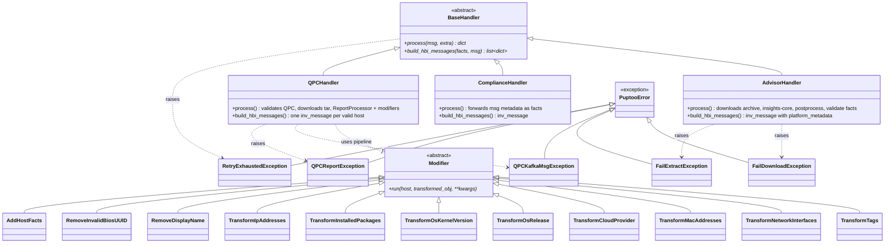

# UML Class Diagram: Handlers and Modifiers

Handler hierarchy for service-type dispatch and QPC report transformation via the modifier pipeline.

## Summary

| Layer       | Role                                                                 |
| ----------- | -------------------------------------------------------------------- |
| BaseHandler | Abstract `process()` and `build_hbi_messages()` contract             |
| Handlers    | Service-specific ingestion and HBI message construction              |
| Modifier    | Per-host QPC fact normalization before canonical-facts check         |
| PuptooError | Typed failures for download, extract, QPC validation, retry exhaustion |
