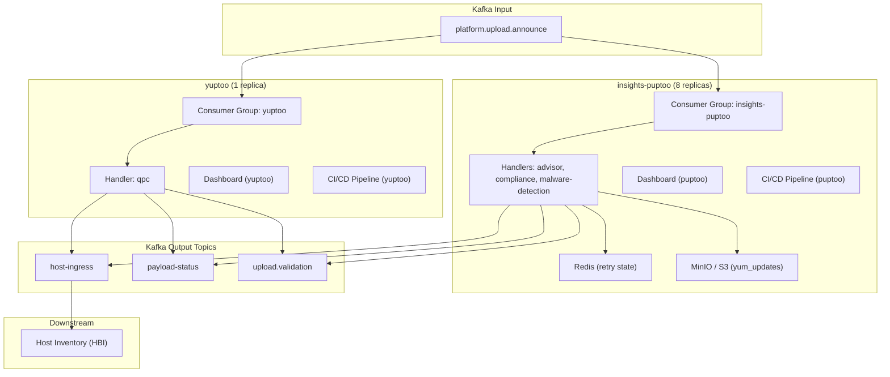
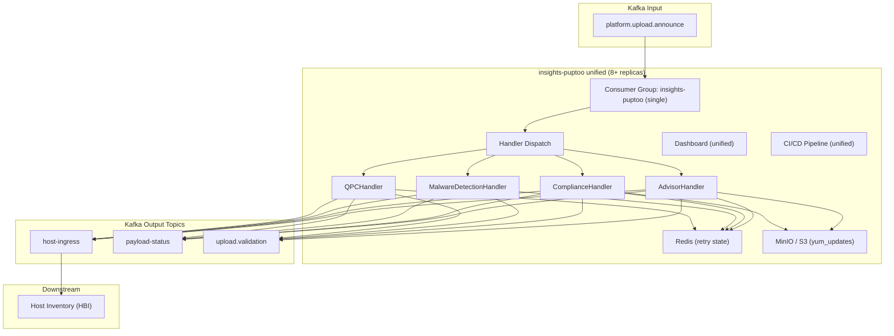

# Component Diagram: As-Is vs To-Be

Architecture comparison for merging **yuptoo** and **insights-puptoo** Kafka consumers into a single unified service.

## As-Is: Two Separate Services

Two independent deployments consume the same input topic with different consumer groups, dashboards, and CI/CD pipelines.

| Aspect              | insights-puptoo              | yuptoo        |
| ------------------- | ---------------------------- | ------------- |
| Replicas            | 8                            | 1             |
| Service headers     | advisor, compliance, malware-detection | qpc |
| Redis               | Yes (retry)                  | No            |
| MinIO / S3          | Yes (yum_updates)            | No            |
| Consumer group      | Separate                     | Separate      |
| Dashboard / CI/CD   | Separate                     | Separate      |

## To-Be: Unified Service

Single merged deployment handles all service types via handler dispatch.

| Aspect              | Unified service                         |
| ------------------- | --------------------------------------- |
| Replicas            | 8+                                      |
| Service headers     | advisor, compliance, malware-detection, qpc |
| Redis / MinIO       | Shared by all handlers                  |
| Consumer group      | Single                                  |
| Dashboard / CI/CD   | Single                                  |
