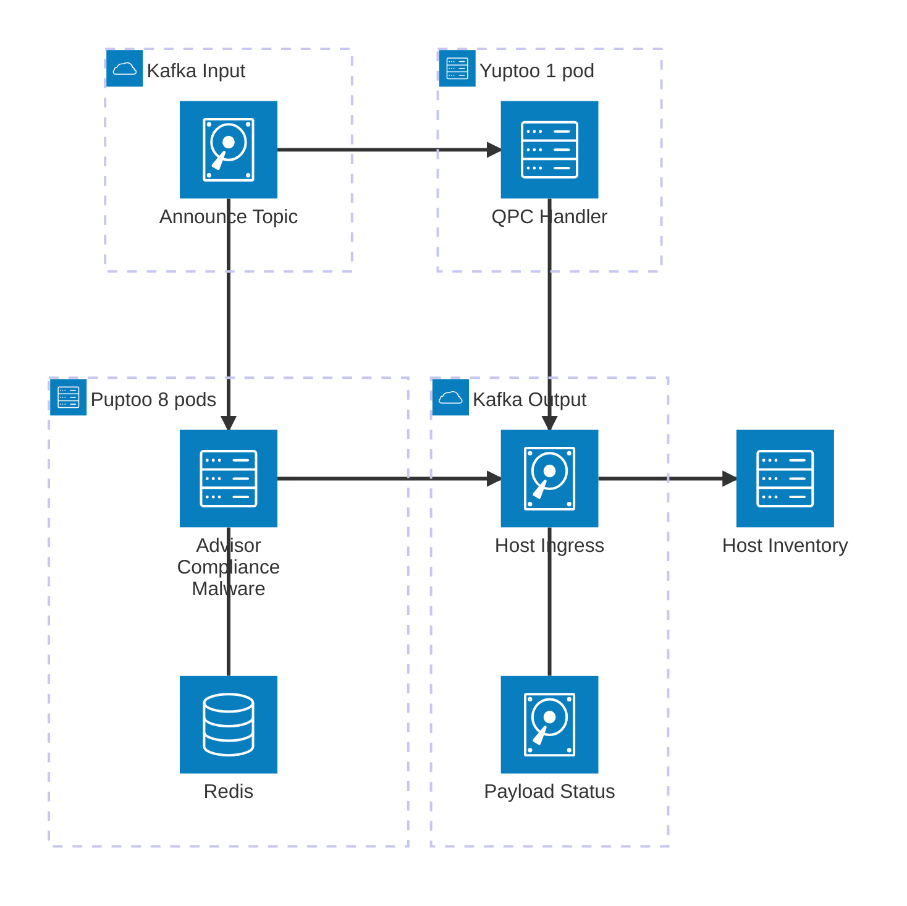
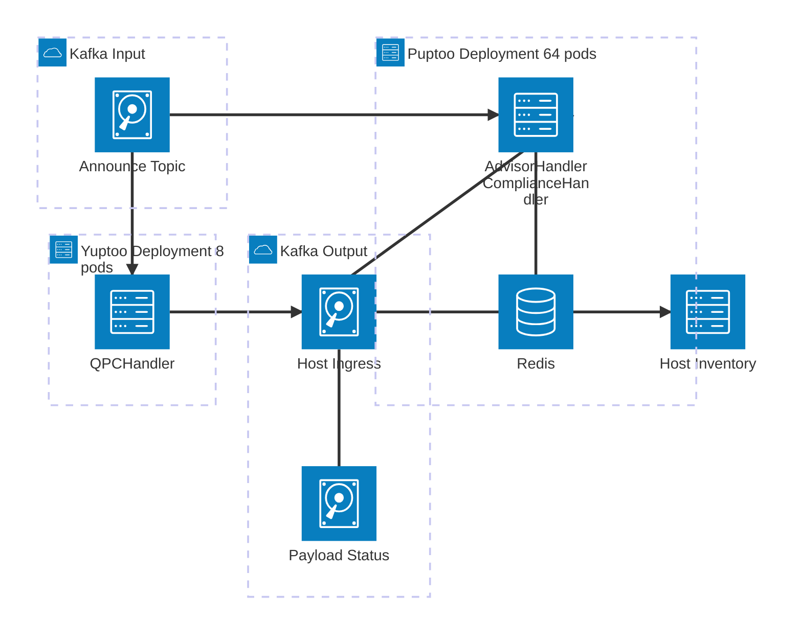

# Component Diagram: As-Is vs To-Be

> **Living diagram, last verified against code: 2026-08-05.** Describes the actual system architecture, not a past decision, so it's updated as the real thing changes (unlike the frozen historical docs elsewhere in this repo). Re-verify once Phase 2 lands `QPCHandler`.

Architecture comparison for merging **yuptoo** and **insights-puptoo** Kafka consumers into a single unified service.

## As-Is: Two Separate Services

Two independent deployments consume the same input topic with different consumer groups, dashboards, and CI/CD pipelines.

> **Rendering:** If this diagram does not render on GitHub, paste the Mermaid source into [mermaid.live](https://mermaid.live) to view it.

| Aspect              | insights-puptoo              | yuptoo        |
| ------------------- | ---------------------------- | ------------- |
| Replicas            | 8                            | 1             |
| Service headers     | advisor, compliance, malware-detection | qpc |
| Redis               | Yes (retry)                  | No            |
| MinIO / S3          | Yes (yum_updates)            | No            |
| Consumer group      | Separate                     | Separate      |
| Dashboard / CI/CD   | Separate                     | Separate      |

## To-Be: Unified Codebase, Multi-Deployment

> [!note] Corrected 2026-08-05
> The version of this diagram below (single deployment, single consumer group) was superseded before implementation began. The team settled on a **multi-deployment** model instead: one codebase and container image, but two independent Kubernetes Deployments, each with its own consumer group, replica count, and `ENABLED_HANDLERS` filter. This preserves the current 72-consumer topology (64 + 8) instead of collapsing it into one 64-consumer group, which would have reduced effective throughput. See [README.md](../../README.md) for the current architecture.

One codebase and container image, deployed as two independent instances filtered by `ENABLED_HANDLERS`.

> **Rendering:** If this diagram does not render on GitHub, paste the Mermaid source into [mermaid.live](https://mermaid.live) to view it.

| Aspect              | Puptoo deployment                       | Yuptoo deployment |
| ------------------- | ---------------------------------------- | ------------------ |
| Replicas            | 64                                       | 8                   |
| Service headers     | advisor, compliance, malware-detection   | qpc                 |
| Consumer group      | `puptoo-upload-processor`                | `yuptoo-upload-processor` |
| Redis / MinIO       | Yes (advisor path only)                  | No                  |
| Container image     | Same image, same repo                    | Same image, same repo |
| Dashboard / CI/CD   | Single (shared codebase, one pipeline)   | Single (shared codebase, one pipeline) |
