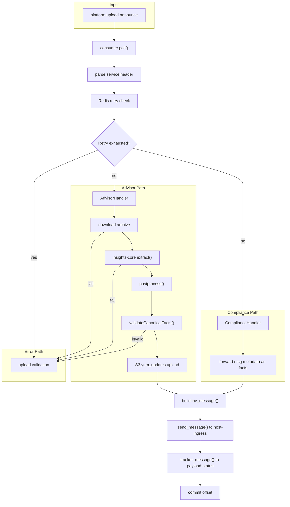
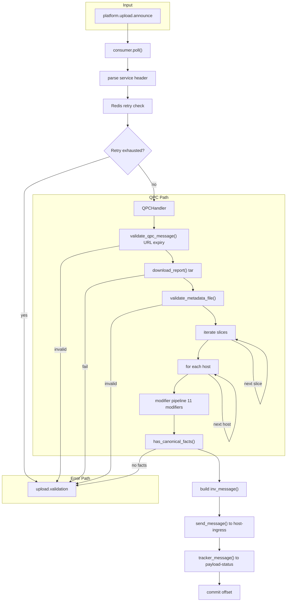

# Data Flow Diagrams

> **Living diagram, last spot-checked against code: 2026-08-05.** The Advisor/Compliance path's major steps (archive download, extraction, postprocessing, yum_updates handling) were confirmed present in the current `insights-puptoo` codebase (Phase 1 complete); this was a structural spot-check, not a full line-by-line trace. The QPC path below describes planned behavior, Phase 2 hasn't built it yet, re-verify once it lands.

Message lifecycle from `platform.upload.announce` through processing to Kafka output topics. Error paths route to `upload.validation`.

## Advisor / Compliance Path

Advisor downloads and extracts archives; compliance forwards metadata without download/extract.

## QPC Path

QPC validates message and report, runs an 11-modifier pipeline per host, then emits inventory messages.

### Modifier Pipeline (QPC)

Applied per host in order: `TransformTags`, `TransformNetworkInterfaces`, `TransformMacAddresses`, `TransformCloudProvider`, `TransformOsRelease`, `TransformOsKernelVersion`, `TransformInstalledPackages`, `TransformIpAddresses`, `RemoveDisplayName`, `RemoveInvalidBiosUUID`, `AddHostFacts`.
