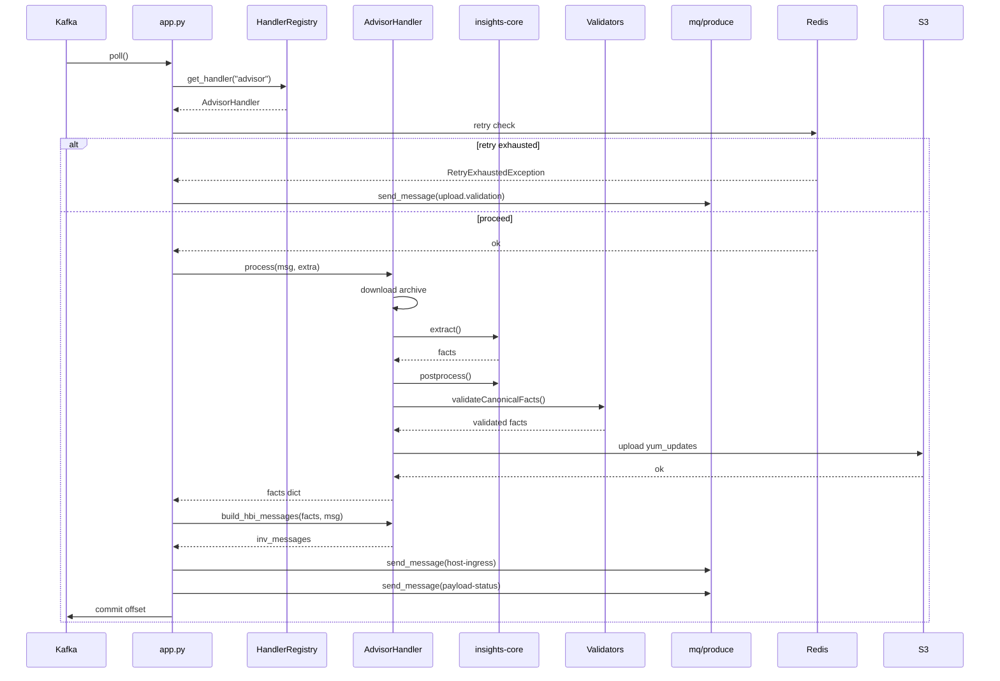
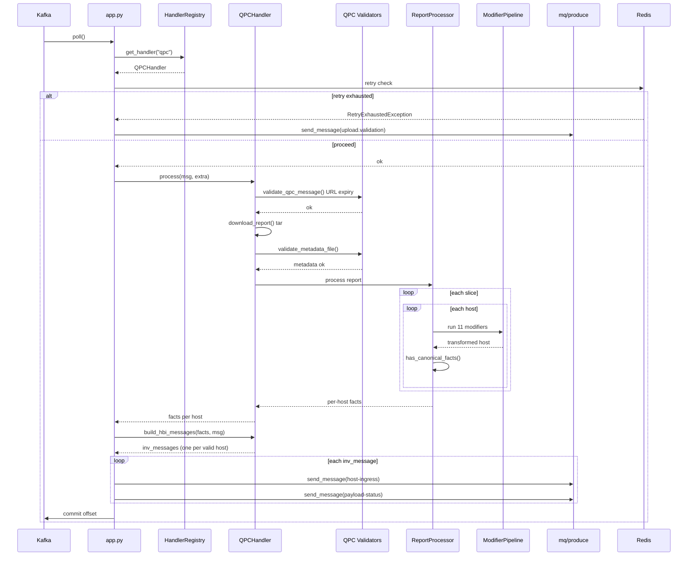

# Sequence Diagrams

> **Living diagram, last verified against code: 2026-08-05.** Advisor sequence's participants confirmed present in `insights-puptoo` (Phase 1 complete). The QPC sequence describes planned behavior, Phase 2 hasn't built it yet, re-verify once it lands.

End-to-end message processing for **advisor** and **qpc** service headers through the unified consumer application.

## Advisor Message Processing

## QPC Message Processing

